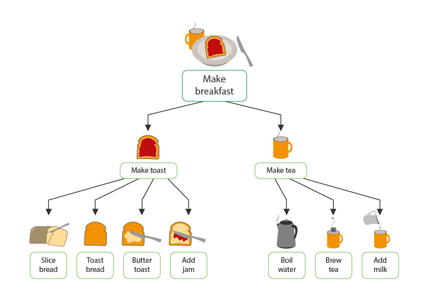

### 1- NE: 
#### Decomposition Nedir ?

Decomposition, karmaşık bir problemi veya sistemi, kavranması, anlaşılması, programlanması ve 
bakımı daha kolay parçalara bölmektir. Yani, karmaşık sorunların daha yönetilebilir parçalara bölünmesidir.

### 2- NEDEN:
#### Decomposition Kullanım Amacı ?
Bir problem ayrıştırılmamışsa, çözülmesi çok daha zordur. 
Aynı anda birçok farklı aşamayla uğraşmak, bir problemi birkaç küçük probleme bölmekten ve 
her birini teker teker çözmekten çok daha zordur. Problemi daha küçük parçalara bölmek, 
her küçük problemin daha detaylı olarak incelenebileceği anlamına gelir. Böylelikle karmaşadan kurtulunmuş olur ve
daha yönetilebilir bir sistem elde edilir.

### 3- NASIL:
#### Decomposition Nasıl Kullanılır ?
Büyük ve karmaşık fonksiyonlar daha küçük ve anlaşılabilir alt fonksiyonlara ayrılırlar.
Daha küçük parçalar daha sonra incelenebilir ve çözülebilir veya üzerinde 
çalışmak daha kolay olduğu için ayrı ayrı tasarlanabilir. Kodlar yazılırken, problem küçük alt parçalara ayrılır. Yani, bir büyük problem çözmek yerine problemi küçük parçalara bölünerek bu küçük problemler çözülerek ilerlenir.

[//]: # (![Example]&#40;example.png&#41;)

